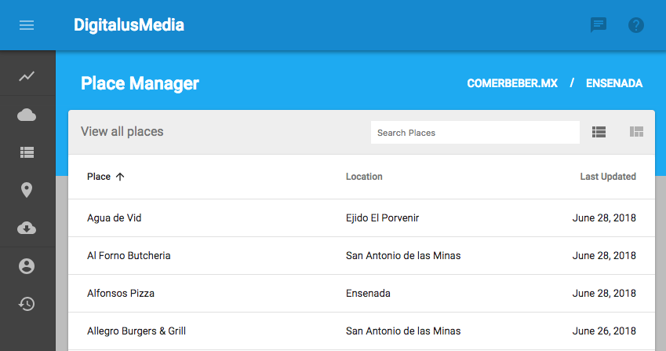

DigFramework
============

__DigFramework is currently in RAD/MVP development!!!__

Core Concept
------------

DigFramework is an opinionated content management / publishing platform that is based on a React and Material UI client
and the Google Cloud Platform on the backend. 

The theory behind the application is that content management has evolved a great deal in the last years, and that content 
can come from anywhere these days. The role of a content management system has grown as well, and we find it easier to 
develop custom solutions based on a low level framework than modify out of the box solutions; you don't have to say no nearly as often.

Dig manages 3 points of interest in your application:

### [User Interface](docs/ui.md)

The system includes a core UI layout, a series of pre built views, and a library of common elements. These are 
all built on Material UI to ensure consistency. You can customize the look and feel of them through the theme configuration
which is an extended version of the core MUI theme variables.

### [State](docs/state.md)

Dig maintains application state within the UI scope and provides utilities accessing public context including
data, the user session, and the theme. It will additionally provide getters and setters for custom data.

### [Data](docs/data.md)

Dig is built on the Google Firestore document database. It provides a simple, standardized client to read
and write data to the core database as well as a wide range of other data sources including Facebook, Twitter, WordPress APIs+++  (soon).

Installation
------------

`npm install dig-framework`

Contribute
----------

Feel free to play around, and if you find any bugs or have ideas for features and improvements please
let us know [here](https://github.com/forrestLyman/dig-framework/issues).

