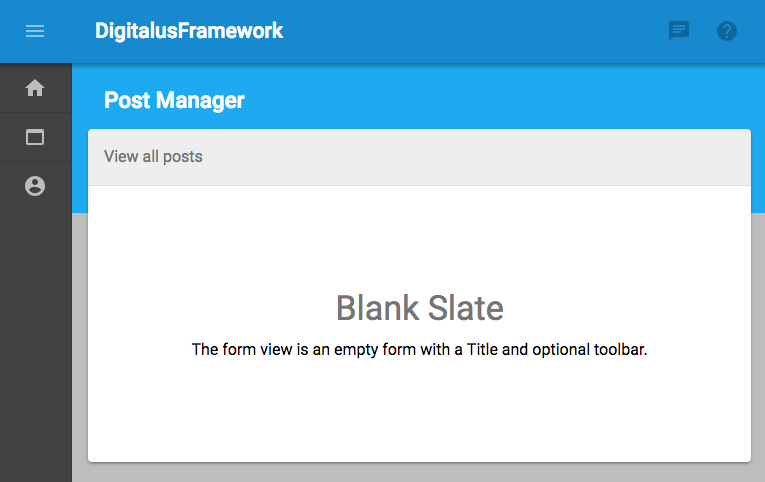
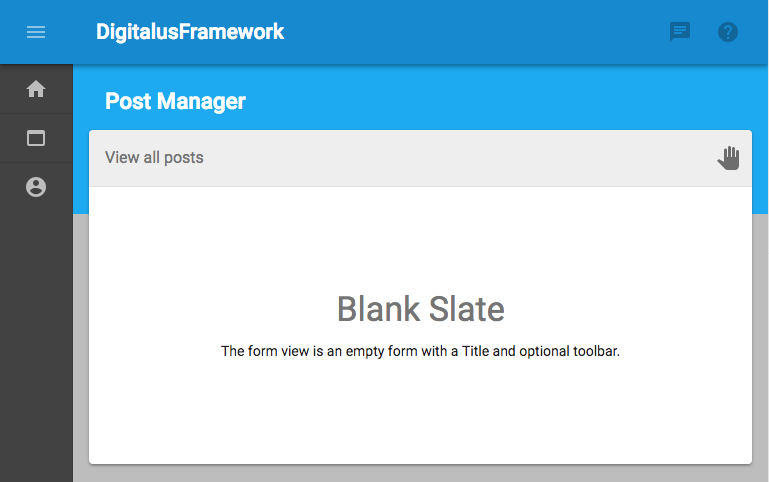
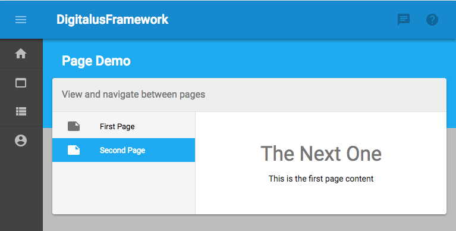
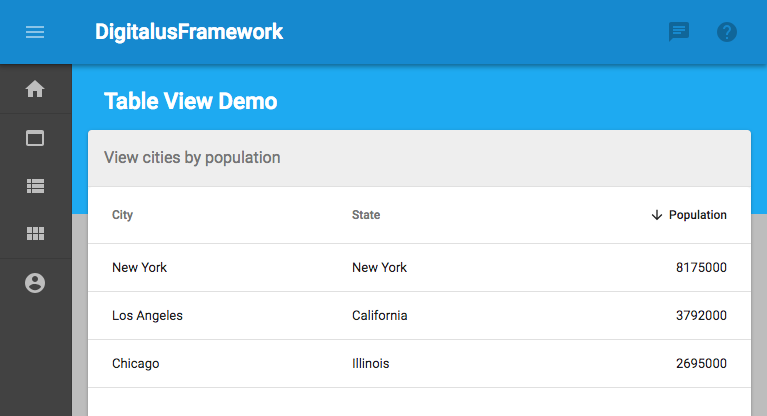

Views
=====

Views are prebuilt layouts for the main application content, which we refer to as the form.

The views are built on Material UI and respect the MUI / Dig theme.

Form
----

The simplest view is the `Form` view. It consist of a blank form body with a title and optional toolbar.

### Options

Prop | Type | Description
-----|------|------------
classes | object | override core classes
title | string | page title
subtitle | string | action title, renders in form toolbar
toolbar | node | optional toolbar

### Example



```javascript
class FormDemo extends React.Component {
  static propTypes = {
    classes: PropTypes.object
  };

  constructor(props) {
    super(props);
    this.state = {};
  }

  render() {
    const {classes} = this.props;
    const viewOptions = {
      form: "Form",
      title: "Post Manager",
      subtitle: "View all posts"
    };

    return <View {...viewOptions}>
      <div className={classes.root}>
        <Typography variant="display1" align="center" gutterBottom>Blank Slate</Typography>
        <Typography variant="body1" align="center">The form view is an empty form with a Title and optional toolbar.</Typography>
      </div>
    </View>;
  }
}
```

[View Complete Source](../src/demo/components/pages/FormDemo/FormDemo.jsx)

### Example with Toolbar

This example is a little more fun and includes a custom toolbar as well as the Dig State to render a message for 
the currently logged in user.

Note that the toolbar is made up of standard MaterialUI buttons. We avoid syntactical sugar, and don't extend core 
components unless there is a compelling reason to do so.



```javascript
class FormDemo extends React.Component {
  static propTypes = {
    classes: PropTypes.object
  };

  constructor(props) {
    super(props);
    this.state = {};
  }

  handleClick = () => {
    console.log('Hi ' + this.props.digUser.name + '!');
  }

  renderToolbar = () => {
    return (
      <div>
        <IconButton onClick={this.handleClick}>
          <HandIcon/>
        </IconButton>
      </div>
    )
  }

  render() {
    const {classes} = this.props;
    const viewOptions = {
      form: "Form",
      title: "Post Manager",
      subtitle: "View all posts",
      toolbar: this.renderToolbar()
    };

    return <View {...viewOptions}>
      <div className={classes.root}>
        <Typography variant="display1" align="center" gutterBottom>Blank Slate</Typography>
        <Typography variant="body1" align="center">The form view is an empty form with a Title and optional toolbar.</Typography>
      </div>
    </View>;
  }
}
```

[View Complete Source](../src/demo/components/pages/FormDemo/FormDemo.jsx)

NavList
----

The `NavList` view renders a very common UI form which consists of a sidebar that is used to navigate between detail
pages and/or sub-forms.

This view requires an array of nav items, which include the following properties:

Prop | Type | Description
-----|------|------------
label | string | link label
icon | node | optional nav item icon
data | mixes | data that you want to return with your callback function

For example:

```javascript
[
  {
    label: "My Nav Item",
    icon: <SomeIcon />,
    data: {
      message: "You clicked my nav item"
    }
  } 
]
```

### Options

Prop | Type | Description
-----|------|------------
classes | object | override core classes
title | string | page title
subtitle | string | action title, renders in form toolbar
toolbar | node | optional toolbar
navListItems | array | an array of items to display in the sidebar
onNavSelected | func | callback function when a nav item is selected, returns the link data

### Example



```javascript
class NavListDemo extends React.Component {
  static propTypes = {
    classes: PropTypes.object
  };

  constructor(props) {
    super(props);
    this.state = {
      pages: [
        {
          label: 'First Page',
          title: 'My First Page',
          body: "This is the first page content"
        },
        {
          label: 'Second Page',
          title: 'The Next One',
          body: "This is the first page content"
        }
      ],
      currentPage: false
    };
  }

  componentWillMount() {
    // start with the first page
    const {pages} = this.state;
    this.setState({currentPage: pages[0]});
  }

  setPage = (page) => {
    this.setState({currentPage: page});
  }

  sidebarData = () => {
    const { pages } = this.state;
    const sidebarData = [];
    pages.map(page => {
      sidebarData.push({
        label: page.label,
        icon: <NotesIcon />,
        data: page
      });
      return page;
    });
    return sidebarData;
  }

  render() {
    const {classes} = this.props;

    const { currentPage } = this.state;
    const viewOptions = {
      form: "NavList",
      title: "Page Demo",
      subtitle: "View and navigate between pages",
      navListItems: this.sidebarData(),
      onNavSelected: this.setPage
    };

    return <View {...viewOptions}>
      <div className={classes.root}>
        <Typography variant="display1" align="center" gutterBottom>{currentPage.title}</Typography>
        <Typography variant="body1" align="center">{currentPage.body}</Typography>
      </div>
    </View>;
  }
}
```

[View Complete Source](../src/demo/components/pages/SidebarListDemo/SidebarListDemo.jsx)


Table View
---------

The `Table` view renders the MaterialUI DataGrid, and supports filtering (searching) as well as sorting and pagination.

The table requires an array of configuration data that defines the columns. These items include the following properties:

Prop | Type | Description
-----|------|------------
id | string | object key for the data row
numeric | bool | whether the field is numeric
label | string | the column header

For example:

```javascript
[
    {
        id: "city",
        numeric: false,
        label: "City"
    }
]
```

### Options

Prop | Type | Description
-----|------|------------
classes | object | override core classes
title | string | page title
subtitle | string | action title, renders in form toolbar
toolbar | node | optional toolbar
columns | array | column configuration
data | array | array of table data to display
onClick | func | callback function when a row is clicked, passes the row data


### Example



```javascript
class TableDemo extends React.Component {
  static propTypes = {
    classes: PropTypes.object
  };

  constructor(props) {
    super(props);
    this.state = {};
  }

  handleClick = (row) => {
    console.log('You selected row:', row);
  }

  render() {
    const {classes} = this.props;

    const columns = [
      {
        id: "city",
        numeric: false,
        label: "City"
      },
      {
        id: "state",
        numeric: false,
        label: "State"
      },
      {
        id: "population",
        numeric: true,
        label: "Population"
      },
    ];

    const data = [
      {
        city: "New York",
        state: "New York",
        population: 8175000
      },
      {
        city: "Los Angeles",
        state: "California",
        population: 3792000
      },
      {
        city: "Chicago",
        state: "Illinois",
        population: 2695000
      }
    ]

    const viewOptions = {
      form: "Table",
      title: "Table View Demo",
      subtitle: "View cities by population",
      columns: columns,
      data: data,
      onClick: this.handleClick
    };

    return <View {...viewOptions}>
      <div className={classes.root}>
        <Typography variant="display1" align="center" gutterBottom>Detail View</Typography>
        <Typography variant="body1" align="center">...</Typography>
      </div>
    </View>;
  }
}
```

[View Complete Source](../src/demo/components/pages/TableDemo/TableDemo.jsx)